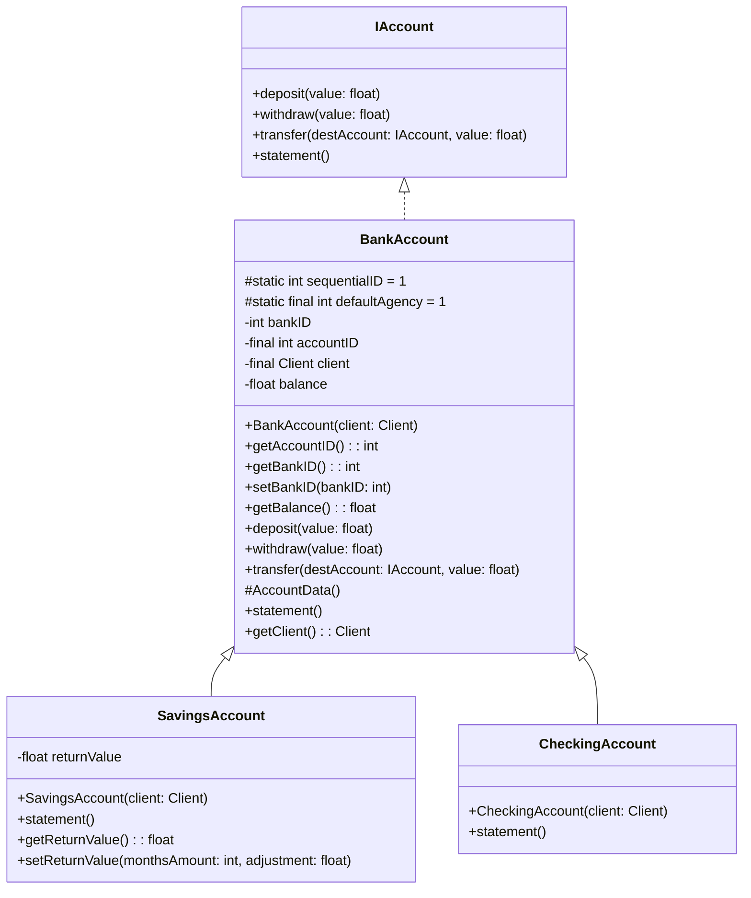

# Formação Java Developer


## 4️⃣ Criando um Banco Digital com Java e Orientação a Objetos

<br><br><br>

## O Que deve ser utilizado

+ POO

## Objetivo

Desafio: Considerando nosso conhecimento no domínio bancário, iremos abstrair uma solução Orientada a Objetos em Java. Para isso, vamos interpretar o seguinte cenário: “Um banco oferece aos seus clientes dois tipos de contas (corrente e poupança), as quais possuem as funcionalidades de depósito, saque e transferência (entre contas da própria instituição).”

Abstração
Habilidade de concentrar-se nos aspectos essenciais de um domínio, ignorando características menos importantes ou acidentais. Nesse contexto, objetos são abstrações de entidades existentes no domínio em questão.

Encapsulamento
Encapsular significa esconder a implementação dos objetos, criando assim interfaces de uso mais concisas e fáceis de usar/entender. O encapsulamento favorece principalmente dois aspectos de um sistema: a manutenção e a evolução.

Herança
Permite que você defina uma classe filha que reutiliza (herda), estende ou modifica o comportamento de uma classe pai. A classe cujos membros são herdados é chamada de classe base. A classe que herda os membros da classe base é chamada de classe derivada.

Polimorfismo
Capacidade de um objeto poder ser referenciado de várias formas, ou seja, é capacidade de tratar objetos criados a partir das classes específicas como objetos de uma classe genérica. Cuidado, polimorfismo não quer dizer que o objeto fica se transformando, muito pelo contrário, um objeto nasce de um tipo e morre daquele tipo, o que pode mudar é a maneira como nos referimos a ele.

## Projeto

### Diagramação



### Implementação

BankAccount.java
```
public abstract class BankAccount implements IAccount {
    protected static int sequentialID = 1;
    protected static final int defaultAgency = 1;

    private int bankID;
    private final int accountID;
    private final Client client;
    private float balance;

    public BankAccount(Client client){
        this.accountID = sequentialID++;
        this.bankID = defaultAgency;
        this.client = client;
        this.balance = 0;
        this.client.addAccount(this);
    }

    public int getAccountID() {
        return accountID;
    }

    public int getBankID() {
        return bankID;
    }

    public void setBankID(int bankID) {
        this.bankID = bankID;
    }


    public float getBalance() {
        return balance;
    }

    public void deposit(float value) {
        try{
            if(value < 0){
                throw new NegativeValueException("O valor de deposito não pode ser negativo");
            }

            this.balance += value;
        }
        catch (Exception e){
            System.out.println(e.getMessage());
        }
    }

    public void withdraw(float value){
        try {
            if(value < 0){
                throw new NegativeValueException("O valor de saque não pode ser negativo");
            } else if (value > balance) {
                throw new NoBalanceException("O valor de saque não pode ser maior que o saldo");
            }
            else
            {
                this.balance -= value;
            }
        }
        catch (Exception e){
            System.out.println(e.getMessage());
        }
    }

    public void transfer(IAccount destAccount, float value){
        try{
            this.withdraw(value);
            destAccount.deposit(value);
        }
        catch (Exception e)
        {
            System.out.println(e.getMessage());
        }
    }
    protected void AccountData() {
        System.out.printf("Agencia: %d%n", this.getBankID());
        System.out.printf("Conta: %d%n", this.getAccountID());
        System.out.printf("Saldo: %.2f%n", this.getBalance());
    }
    public void statement(){}

    public Client getClient() {
        return client;
    }

    static class NegativeValueException extends Exception {
        public NegativeValueException(String message) {
            super(message);
        }
    }

    static class NoBalanceException extends Exception {
        public NoBalanceException(String message) {
            super(message);
        }
    }
}

```

SavingAccount.java
```
import java.util.Random;

public class SavingsAccount extends BankAccount{
    float returnValue;

    public SavingsAccount(Client client) {
        super(client);
        this.returnValue = 0;
    }

    @Override
    public void statement() {
        System.out.println("=== Extrato Conta Poupança ===");
        this.AccountData();
        System.out.printf("Rendimentos: %.2f%n", this.getReturnValue());
    }

    public float getReturnValue() {
        Random rand = new Random();
        float n = rand.nextFloat(3)+3;
        int m = rand.nextInt(12)+ 12;
        this.setReturnValue(m, n);
        return this.returnValue;
    }

    public void setReturnValue(int monthsAmount, float adjustment){
        this.returnValue = (float) (this.getBalance() * Math.pow(1 + adjustment/100, monthsAmount));
    }
}
```

CheckingAccount.java
```
public class CheckingAccount extends BankAccount {
    public CheckingAccount(Client client) {
        super(client);
    }

    @Override
    public void statement() {
        System.out.println("=== Extrato Conta Corrente ===");
        this.AccountData();
    }
}

```

IAccount.java
```
public interface IAccount {
    void deposit(float value);
    void withdraw(float value);
    void transfer(IAccount destAccount, float value);
    void statement();
}
```

### Extra - Interface

