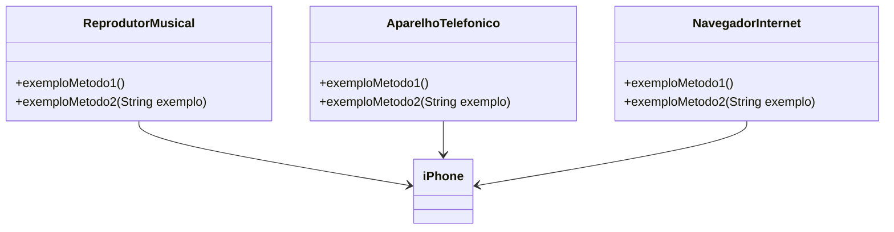
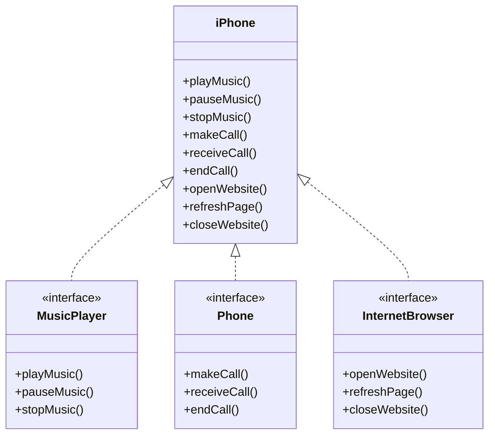

# Formação Java Developer


## 3️⃣: Modelando o iPhone com UML: Funções de Músicas, Chamadas e Internet
O desafio consiste em modelar e diagramar um componente iPhone utilizando UML, representando suas funcionalidades de Reprodutor Musical, Aparelho Telefônico e Navegador na Internet, com base no vídeo de lançamento do iPhone de 2007

<br><br><br><br><br>

## O Que deve ser utilizado

+ UML

## Objetivo

### Modelagem e Diagramação de um Componente iPhone

Neste desafio, você será responsável por modelar e diagramar a representação UML do componente iPhone, abrangendo suas funcionalidades como Reprodutor Musical, Aparelho Telefônico e Navegador na Internet.

#### Contexto
Com base no vídeo de lançamento do iPhone de 2007 (link abaixo), você deve elaborar a diagramação das classes e interfaces utilizando uma ferramenta UML de sua preferência. Em seguida, implemente as classes e interfaces no formato de arquivos `.java`.

[Lançamento iPhone 2007](https://www.youtube.com/watch?v=9ou608QQRq8)
- Minutos relevantes: 00:15 até 00:55

#### Funcionalidades a Modelar
1. **Reprodutor Musical**
   - Métodos: `tocar()`, `pausar()`, `selecionarMusica(String musica)`
2. **Aparelho Telefônico**
   - Métodos: `ligar(String numero)`, `atender()`, `iniciarCorreioVoz()`
3. **Navegador na Internet**
   - Métodos: `exibirPagina(String url)`, `adicionarNovaAba()`, `atualizarPagina()`

### Objetivo
1. Criar um diagrama UML que represente as funcionalidades descritas acima.
2. Implementar as classes e interfaces correspondentes em Java (Opcional).

### Exemplo de Diagrama UML (Mermaid)


### Instruções
1. Assista ao vídeo do lançamento do iPhone para entender as funcionalidades principais.
2. Utilize uma ferramenta UML de sua preferência para criar o diagrama das classes e interfaces. Você pode utilizar o modelo acima (criado na sintaxe [Mermaid](https://mermaid.js.org/)), uma alternativa open-source e compatível com arquivos Markdown como este.
3. Opcionalmente, caso esteja cheio(a) de confiança, pode implementar as classes Java representadas em seu diagrama UML.
4. Submeta seu repositório GitHub conforme as orientações da plataforma DIO. Por exemplo:

```bash
https://github.com/glysns/trilha-java-basico/desafios/poo/README.md
```` 


## Projeto



### Extra - Classes Java

#### MusicPlayer.java

```

public interface MusicPlayer {
    void playMusic();
    void pauseMusic();
    void stopMusic();
}

```

#### Phone.java

```
public interface Phone {
    void makeCall();
    void receiveCall();
    void endCall();
}
```

#### InternetBrowser.java

```
public interface InternetBrowser {
    void openWebsite();
    void refreshPage();
    void closeWebsite();
}

```

#### Iphone.java

```
public class iPhone implements MusicPlayer, Phone, InternetBrowser {
    @Override
    public void playMusic() {
        // Implementação do método playMusic
    }

    @Override
    public void pauseMusic() {
        // Implementação do método pauseMusic
    }

    @Override
    public void stopMusic() {
        // Implementação do método stopMusic
    }

    @Override
    public void makeCall() {
        // Implementação do método makeCall
    }

    @Override
    public void receiveCall() {
        // Implementação do método receiveCall
    }

    @Override
    public void endCall() {
        // Implementação do método endCall
    }

    @Override
    public void openWebsite() {
        // Implementação do método openWebsite
    }

    @Override
    public void refreshPage() {
        // Implementação do método refreshPage
    }

    @Override
    public void closeWebsite() {
        // Implementação do método closeWebsite
    }
}

```


